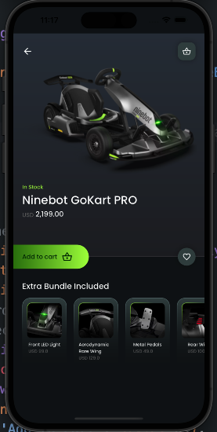
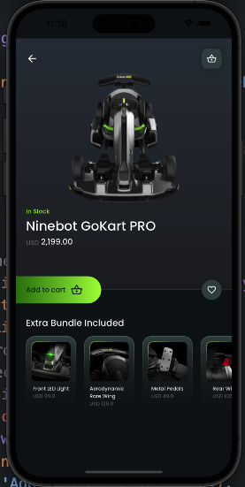
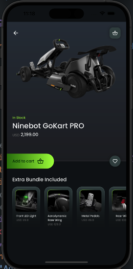

# Flutter Ninebot Gokart PRO Mobile App UI

Design Credits: sinthaistudio [View on Instagram](https://www.instagram.com/sinthaistudio/)

## Description

Welcome to the Ninebot Gokart PRO Mobile App UI Design Concept! This Flutter-based mobile application introduces an innovative user interface designed for controlling and engaging with the Ninebot Gokart PRO. With an added 360-degree gokart view feature, this concept offers an immersive and interactive experience for enthusiasts and curious users alike.

## Features

- **360-Degree Gokart View:** Explore the Ninebot Gokart PRO from all angles using an interactive 360-degree view feature.
- **View Detailed Product Info:** Get in-depth information about the Gokart's specifications, features, and more.
- **Add to Cart:** Choose your favorite Gokart features and add them to your cart for future purchase.
- **Responsive UI:** Enjoy a stylish and responsive user interface designed for seamless mobile interaction.

## Screenshots





## Getting Started

Follow the steps below to set up the project on your local machine and run it:

1. Clone the repository:

```bash
git clone https://github.com/JosephDoUrden/Ninebot_GoKart_PRO
cd Ninebot_GoKart_PRO/
flutter run
```

## Contact

If you have any questions, feedback, or would like to connect, feel free to reach out to me.

- **Name:** Yusufhan Saçak
- **Email:** yusufhan.sacak@bahcesehir.edu.tr
- **Website:** https://medium.com/@yusufhansacak
- **Twitter:** [@0xSCK](https://twitter.com/0xSCK)
- **LinkedIn:** [Yusufhan Saçak](https://www.linkedin.com/in/yusufhansacak/)

Feel free to contact me through any of the channels above. I'm open to collaborations and discussions related to Flutter development or any other projects.
